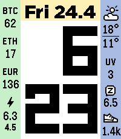
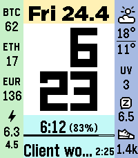
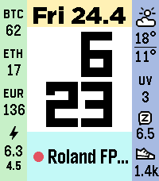

# Sykerö TimeStyle

> **Fork notice:** **Sykerö TimeStyle** is a fork of
> [freakified/TimeStylePebble](https://github.com/freakified/TimeStylePebble)
> ("TimeStyle"), maintained by Sykerö Software. It adds a TWT (Track Work Time)
> status line and PebbleKit Android 2 companion integration. All credit for the
> original watchface goes to the upstream authors.

Sykerö TimeStyle is a stylish, modern watchface for the Pebble and Pebble Time
watches.

**[Install from the Pebble appstore →](https://apps.repebble.com/syker-timestyle_66eceeb78146451aac714547)**

*Left:* two configurable widget columns (here: BTC, ETH, EUR/USD, electricity
price · weather, UV index, sleep, steps), customizable colours. *Middle:* live
**Sykerö Track Work Time** status. *Right:* live **MIDI Recorder** status.

Inspired by the visual language of the Timeline found on the Pebble Time, Sykerö TimeStyle is designed as the “present” to complement the Timeline’s “past” and “future”.

* Readable: With more than 80% of the display area devoted to the time and 6 font options, it's designed for readability in all conditions. Unlike most other Pebble faces, time text is displayed using antialiasing, achieved using palette swapping.
* Colorful: includes over 20 preset color schemes, and also supports custom colors using any color the Pebble Time can display&mdash;also supports saving, loading, and sharing custom presets!
* Configurable: it features a wide variety of different complications, including step counts, sleep times, weather forecasts, the week number, seconds, the time in another time zone, the battery level, and more.
* Keeps you informed: it automatically displays notifications when the battery is low or when your phone disconnects.
* Works in 30 different languages, more than any other Pebble face: English, French, German, Spanish, Italian, Dutch, Turkish, Czech, Slovak, Portuguese, Greek, Swedish, Polish, Romanian, Vietnamese, Catalan, Norwegian, Russian, Estonian, Basque, Finnish, Danish, Lithuanian, Slovenian, Hungarian, Croatian, Serbian, Irish, Latviann, and Ukrainian.

## Track Work Time integration

This fork adds a work-time status strip, fed over PebbleKit Android 2 by the
[trackworktime](https://github.com/Sykero-Software/trackworktime) Android app. To
control tracking from the wrist (pick a task, start/stop), pair it with the
companion watchapp
[Sykerö Track Work Time](https://github.com/Sykero-Software/PebbleTrackWorkTime).

## Analog clock face

TimeStyle can show an **analog clock** in place of the digital time, taking the
same central area (config → *Clock → Clock style → Analog*); the 12 hour marks
are toggleable via *Analog hour marks*.

The analog face (bold geometric hands, hour ticks and centre pivot) is **ported
from the [Nyquist watchface](https://github.com/truhanen/pebble-nyquist-watchface)
by truhanen**, used under the GPL-3.0 license. Many thanks to truhanen for the
original design.

## License

This fork is a combined work distributed under the **GNU General Public License
v3.0 only** (GPL-3.0-only); see [`LICENSE`](LICENSE).

The optional analog clock face is ported from the
[Nyquist watchface](https://github.com/truhanen/pebble-nyquist-watchface) by
truhanen, which is licensed under **GPL-3.0**; the source credit is kept in the
header of [`src/c/clock_analog.c`](src/c/clock_analog.c). GPL-3.0-into-GPL-3.0
reuse is license-compatible.

The upstream TimeStyle code by Dan Tilden and the original TimeStyle contributors
remains available under the **MIT License** from
[freakified/TimeStylePebble](https://github.com/freakified/TimeStylePebble); that
license text is preserved in [`LICENSE.MIT`](LICENSE.MIT). MIT permits
incorporating the original code into a GPL-licensed work, provided the MIT
copyright and permission notice are retained (they are, in `LICENSE.MIT`).

Files added by this fork (e.g. the TWT, electricity-price, BTC-price and
date-header features and their tests) carry an `SPDX-License-Identifier:
GPL-3.0-only` header and are © 2026 Tuomas Airaksinen. All contributions made to
this fork going forward are licensed under GPL-3.0-only.

## Support

Questions, feedback or bug reports: <pebble.trackworktime@sykero.fi>

Browse all Sykerö Software apps on the Pebble appstore:
<https://apps.repebble.com/apps/dev/syker-software_9f6c9c6e9ce88af6a0db953e>
